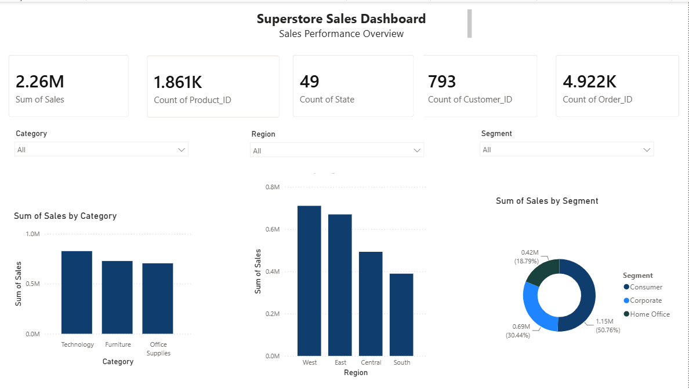
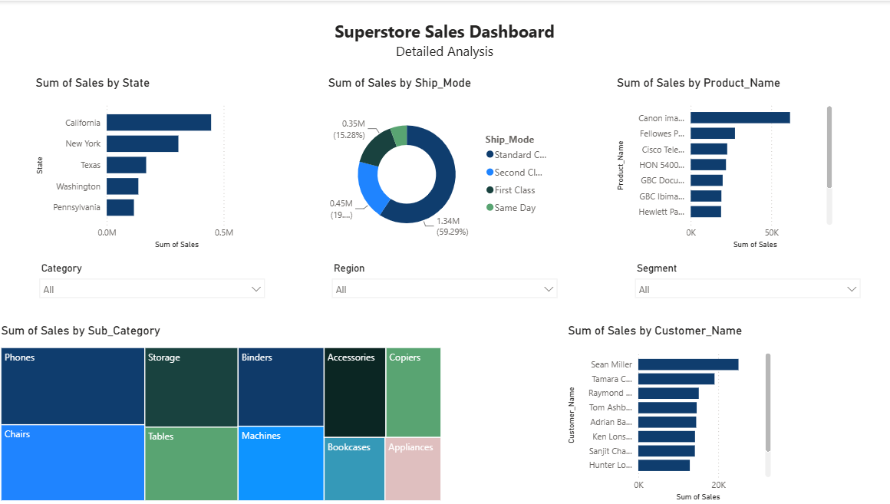
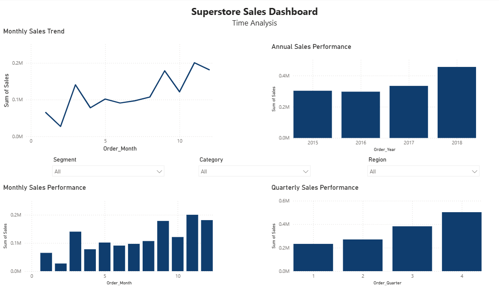

# Superstore Sales Analysis

## Project Overview

An end-to-end data analytics project based on the Superstore dataset.

The project covers data ingestion, data transformation, SQL analysis, and interactive dashboard development using Power BI.

## Tools & Technologies

- Azure Data Factory
- Azure SQL Database
- SQL
- Power BI
- GitHub

## Data Pipeline

CSV Dataset
→ Azure Data Factory
→ Azure SQL Database
→ SQL Analysis
→ Power BI Dashboard

## SQL Analysis

The SQL analysis includes:

- Data quality checks
- Sales analysis
- Time-based analysis
- Customer analysis
- Business questions

## Power BI Dashboard

The Power BI report contains three main sections:

### Overview
High-level KPIs and sales performance.

### Detailed Analysis
Product, customer, state, shipping, and profitability analysis.

### Time Analysis
Sales trends by year, month, and quarter.

## Key Business Questions

- Which region generates the highest sales?
- Which category performs best?
- Which customers generate the most sales?
- Which products have the highest sales?
- How do sales change over time?

## Project Outcome

This project demonstrates an end-to-end data analytics workflow, from data ingestion and transformation to SQL-based analysis and interactive Power BI dashboard development.

It showcases the ability to:

- Build a data pipeline using Azure Data Factory
- Store and transform data in Azure SQL Database
- Perform data quality checks and business analysis using SQL
- Create interactive dashboards and visualizations in Power BI
- Translate business questions into data-driven insights
